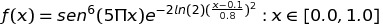
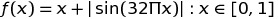
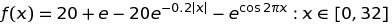
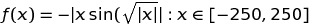
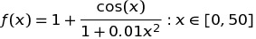
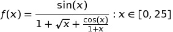
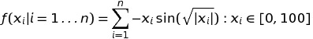
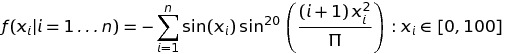

# Actividad-FuncionesContinuas-DEAP

Implemente un algoritmo que dé solución de los siguiente problemas de maximización y minimización de funciones continuas utilizando DEAP.

## Entregables
Se deberá entregar lo siguiente:

  > * La implementación del algoritmo genético de cada uno de los problemas en un archivo python.
  > * Se incluirá un jupyter notebook que muestre mediante gráficas la solución de los algoritmos implementados.

## Problemas de Maximización

  1. 
  2. 
  3. 

## Problemas de Minimización

  1. 
  2. 
  3. 

## Problemas de $n$ variables

  1. 
  2. 

---
| n | Mínimo |
|---|---|
| 1 | -1 |
| 2 | -1.959091 |
| 3 | -2.897553 |
| 4 | -3.886358 |
| 5 | -4.886358 |
| 6 | -5.879585 |
| 7 | -6.862457 |
| 8 | -7.858851 |
| 9 | -8.858851 |
| 10 | -9.856182 |

  3. 
  4. 

  5. $f(x,y) = 0.1xy$  $\forall xy \in [-1.25, 1.25]$ sujeto a 
